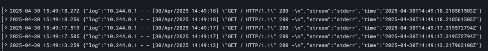

# simple url shortener
 Exercising and learning some new technologies!
 Objective is to create a simple ULR shortener python app running in k8s, storing the data in a DB.
 POST a long URL → get a short code
 Access the short code → redirect to the original URL

 Roadmap:
 1. Build the Python App running locally ✅
    With a local db and postman
    
    Added a simple front
    
 2. Containerize It ✅
    Added dockerfile and tested locally
    
 3. CI/CD (optional stretch goal)
    Lets add some automation on image building
    
 4. Infrastructure as Code
 5. Service as Code
 6. Secure the System
 7. Observability & Monitoring